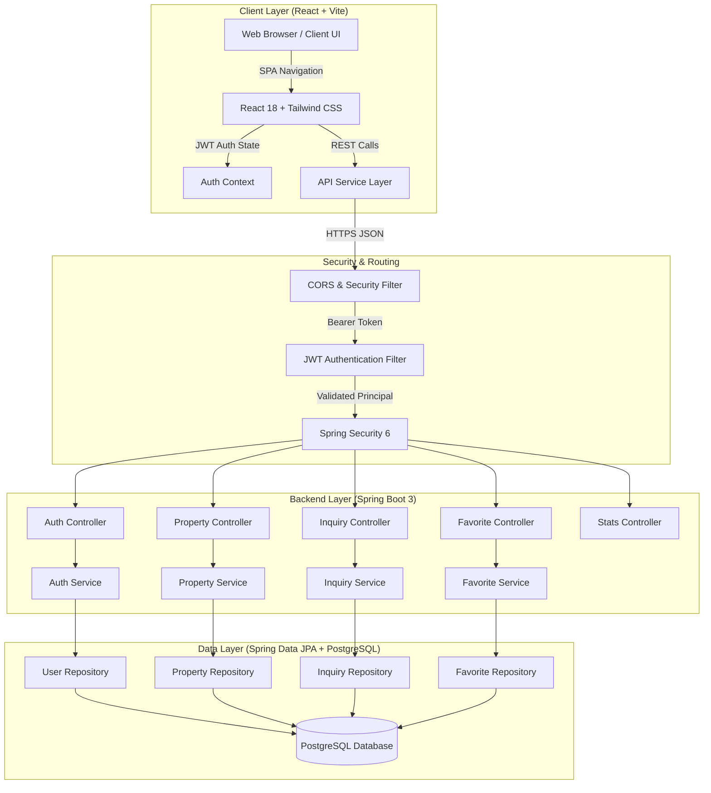
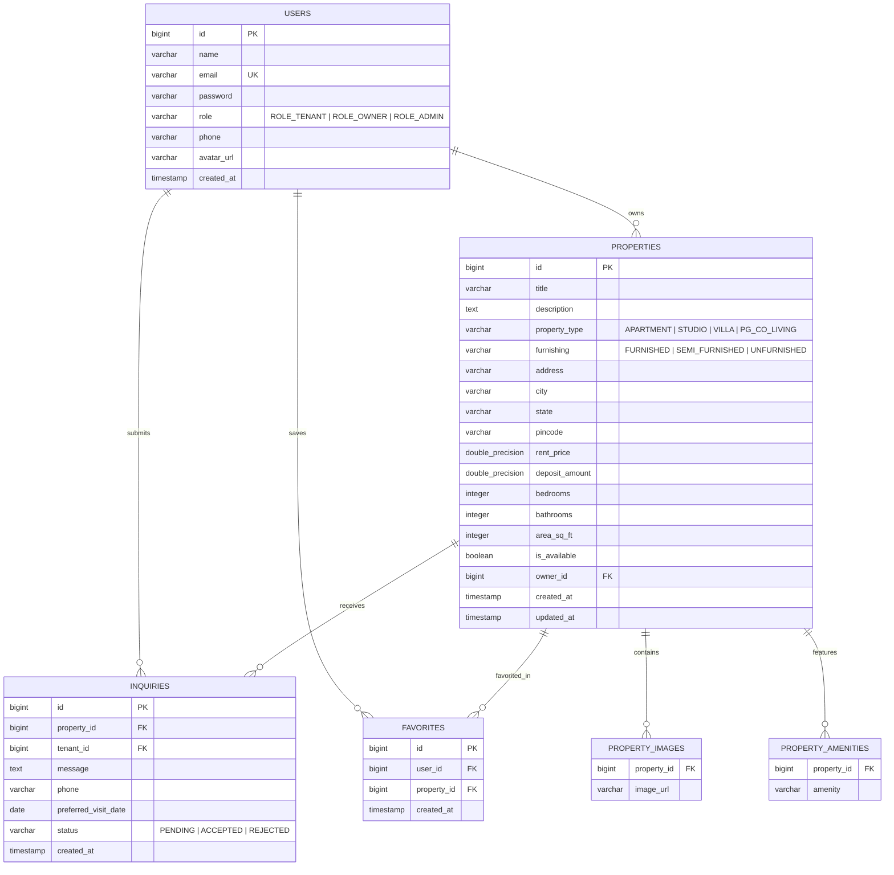

# 🏠 HomeLink — Housing Rental Without Middlemen

> **University-Level Full-Stack Engineering Capstone Project**  
> A transparent, direct-connection housing rental platform eliminating broker fees by connecting property owners directly with tenants.

---

## 📌 1. Project Overview & Problem Statement

### The Problem
In traditional housing rental ecosystems, brokers and middlemen extract **15 days to 1 full month of rent** as non-refundable brokerage fees simply for sharing a phone number or unlocking an apartment door. For students, fresh graduates, and families, this creates a heavy and unnecessary financial burden, while often leading to misleading property descriptions and communication friction.

### The HomeLink Solution
**HomeLink** provides an open, direct owner-to-tenant marketplace:
1. **Direct Contact**: Tenants directly call or message property owners via phone or WhatsApp.
2. **Zero Brokerage**: Neither tenants nor owners pay any commission or hidden intermediary fees.
3. **Scheduled Visits**: Tenants request verified in-person walkthroughs with custom messages and preferred dates.
4. **Owner Management Portal**: Homeowners publish, update, and manage property listings and incoming inquiries from a single dashboard.

---

## 🏛️ 2. System Architecture



---

## 🗄️ 3. Database Schema (Entity-Relationship Diagram)



---

## 💻 4. Technology Stack Summary

| Layer | Technology | Key Capabilities / Rationale |
| :--- | :--- | :--- |
| **Frontend** | React 18, Vite | High performance bundling, fast reactive rendering, modular SPA architecture |
| **Styling** | Tailwind CSS 3.4 | Utility-first responsive design, modern glassmorphism cards and badges |
| **Icons** | Lucide React | Clean, scalable feather-style SVG icon set |
| **Backend** | Java 17+, Spring Boot 3.2 | Enterprise-grade REST microframework, strong typing, mature ecosystem |
| **Security** | Spring Security 6, JJWT | Stateless JSON Web Token authentication, BCrypt password hashing |
| **Validation** | Jakarta Bean Validation | Declarative constraint annotations (`@NotBlank`, `@Email`, `@Positive`) |
| **ORM / JPA** | Spring Data JPA, Hibernate | Object-Relational mapping, JPQL custom search queries, automated schema management |
| **Database** | PostgreSQL / H2 | Relational integrity, foreign keys, cloud-ready SQL; embedded H2 for instant local demo |
| **Testing** | JUnit 5, Mockito | Unit tests and Spring Boot integration tests |
| **Frontend Host**| Vercel | Instant global edge CDN distribution with automatic Git CI/CD |
| **Backend Host** | Render | Docker-based containerized runtime, managed SSL, and automated build pipeline |

---

## 📡 5. REST API Documentation

### Authentication (`/api/auth`)
| Method | Endpoint | Access | Description |
| :--- | :--- | :--- | :--- |
| `POST` | `/api/auth/register` | Public | Register new tenant or owner account |
| `POST` | `/api/auth/login` | Public | Authenticate user credentials and return JWT |
| `GET` | `/api/auth/me` | Authenticated | Fetch authenticated user profile details |

### Properties (`/api/properties`)
| Method | Endpoint | Access | Description |
| :--- | :--- | :--- | :--- |
| `GET` | `/api/properties` | Public | Search properties by city, price range, BHK, type |
| `GET` | `/api/properties/featured` | Public | Get featured newest rental homes |
| `GET` | `/api/properties/{id}` | Public | Retrieve full property details and owner information |
| `POST` | `/api/properties` | Owner / Admin | Create a new rental listing |
| `PUT` | `/api/properties/{id}` | Listing Owner | Update property details or availability |
| `DELETE`| `/api/properties/{id}` | Listing Owner | Remove property listing |
| `GET` | `/api/properties/my-listings` | Owner | Retrieve all properties owned by current user |

### Inquiries & Visits (`/api/inquiries`)
| Method | Endpoint | Access | Description |
| :--- | :--- | :--- | :--- |
| `POST` | `/api/inquiries` | Tenant | Submit direct rental inquiry or request property visit |
| `GET` | `/api/inquiries/my-inquiries` | Tenant | Retrieve inquiries submitted by the tenant |
| `GET` | `/api/inquiries/owner-inquiries`| Owner | Retrieve incoming inquiries for owner's properties |
| `PATCH`| `/api/inquiries/{id}/status` | Owner | Accept or decline requested visit date |

### Favorites & Platform Stats
| Method | Endpoint | Access | Description |
| :--- | :--- | :--- | :--- |
| `POST` | `/api/favorites/{propertyId}/toggle` | Authenticated | Add or remove property from favorites |
| `GET` | `/api/favorites` | Authenticated | List all bookmarked properties for user |
| `GET` | `/api/stats` | Public | Platform overview metrics & estimated brokerage saved |

---

## 🔑 6. Pre-Configured Demo Accounts (Ready for Viva & Evaluation)

For fast evaluation and live demonstrations, the system comes with seeded accounts and 1-click login buttons in the UI:

| Role | Email | Password | Pre-seeded Content |
| :--- | :--- | :--- | :--- |
| **Owner** | `owner@homelink.com` | `Owner@123` | Listed properties in Bangalore & Pune, incoming tenant inquiries |
| **Owner 2** | `priya.owner@homelink.com` | `Owner@123` | Listed properties in Mumbai & Hyderabad |
| **Tenant** | `tenant@homelink.com` | `Tenant@123` | Active inquiries, shortlisted favorite homes |

*(You can also register brand-new accounts directly through the UI modal)*

---

## 🚀 7. Running the Project Locally

### Prerequisites
- **Node.js** (v18 or higher) and **npm**
- **Java 17+** and **Maven** (Optional for UI test, required for Java backend execution)

### 7.1 Frontend Setup (React + Vite)
```bash
cd frontend
npm install
npm run dev
```
Open **`http://localhost:5173`** in your browser.  
*(Note: If the backend is not running yet, the frontend automatically activates its built-in fallback mock store, allowing complete end-to-end testing of listings, filters, inquiries, and dashboards immediately!)*

### 7.2 Backend Setup (Spring Boot 3)
```bash
cd backend
# Run with Maven (automatically seeds sample properties & demo accounts in H2):
mvn spring-boot:run
```
The backend starts on **`http://localhost:8080`**.  
The interactive H2 database console is accessible at: `http://localhost:8080/h2-console` (JDBC URL: `jdbc:h2:mem:homelinkdb`, User: `sa`, Password: empty).

---

## ☁️ 8. Cloud Deployment Guide

### A. Deploy Frontend on Vercel
1. Push this repository to GitHub:
   ```bash
   git init
   git add .
   git commit -m "Initial HomeLink release"
   git remote add origin https://github.com/<your-username>/homelink.git
   git push -u origin main
   ```
2. Log in to [Vercel](https://vercel.com) and click **"Add New Project"**.
3. Import your GitHub repository.
4. Set the **Root Directory** to `frontend`.
5. Under **Environment Variables**, add:
   - `VITE_API_BASE_URL` = `https://<your-render-backend-url>.onrender.com/api`
6. Click **Deploy**. Vercel will build and assign a public `*.vercel.app` URL.

### B. Deploy Backend & PostgreSQL on Render
1. Create a free account on [Render](https://render.com).
2. Click **New +** → **Blueprint**.
3. Connect your GitHub repository. Render will automatically read the included `render.yaml` file, provisioning:
   - A free managed **PostgreSQL Database** (`homelink-db`)
   - A containerized **Spring Boot Web Service** built via `backend/Dockerfile`
4. Set the environment variable `FRONTEND_URL` to your Vercel domain to configure CORS.
5. Click **Apply**. Once built, the backend will be live with HTTPS.

---

## 🎓 9. College Viva / Defense FAQ Cheat Sheet

**Q1: Why did you choose Java + Spring Boot for the backend instead of Node.js / Express?**  
*Answer:* Spring Boot provides enterprise-standard architectural layers (Controller-Service-Repository pattern), strict compile-time type safety with Java 17, and first-class security abstractions (Spring Security 6 with declarative role authorization). This mirrors real-world production banking and real-estate systems.

**Q2: How does HomeLink handle authentication securely?**  
*Answer:* The application implements stateless JSON Web Token (JWT) authentication. Upon valid login credentials verified against BCrypt-hashed passwords in the database, the server issues a signed HMAC-SHA256 token. The client sends this token in the `Authorization: Bearer <token>` header for protected endpoints, avoiding session state on the server and enabling horizontal scaling.

**Q3: How does the application prevent cross-origin issues (CORS)?**  
*Answer:* The `SecurityConfig` class declares a `CorsConfigurationSource` bean allowing configured origin patterns (`localhost:5173`, `*.vercel.app`) with allowed methods (`GET, POST, PUT, PATCH, DELETE, OPTIONS`) and standard credential transmission headers.

**Q4: How does HomeLink demonstrate relational database normalization?**  
*Answer:* The database adheres to 3rd Normal Form (3NF). Relationships are normalized: Users are decoupled from Properties (`1:N`), Inquiries link Tenants and Properties (`N:1`), and Favorites maintain a unique composite constraint `(user_id, property_id)` preventing duplicate bookmarks.
